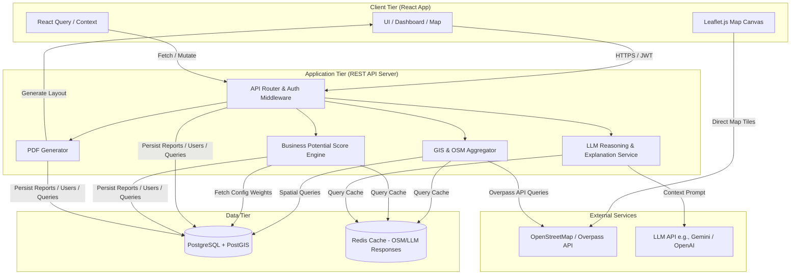
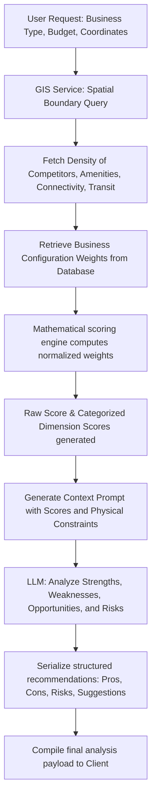
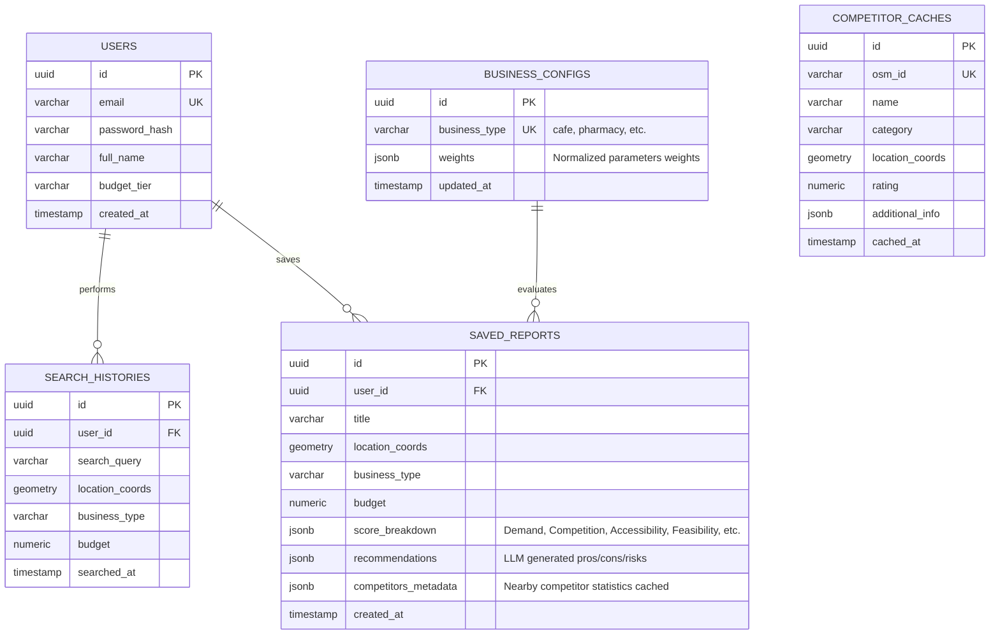

# BizNest Architecture Design Document

**Tagline**: "Predict the potential before you invest."

---

## 1. System & Micro-Architecture

BizNest uses a decoupled **Client-Server** architecture. The React frontend handles the rendering of maps, dashboards, interactive controls, and comparison tables. The backend (Node.js/Express + TypeScript or Python/FastAPI) houses the mathematical scoring engine, handles database queries, manages GIS external API requests, and acts as the gatekeeper for the LLM reasoning agent.

### System Architecture Diagram


### Business Potential Score Pipeline
The score engine calculates ratings mathematically to ensure transparency. The LLM is used **only** to translate these metrics into structured, human-readable prose.



---

## 2. Folder Structure

A monorepo structure is proposed to keep the React frontend and backend code cleanly separated but in a single repository.

```
biznest/
├── .gitignore
├── README.md
├── package.json
├── backend/
│   ├── package.json
│   ├── tsconfig.json
│   ├── src/
│   │   ├── app.ts                 # Express app setup
│   │   ├── server.ts              # Entry point
│   │   ├── config/                # Environment variables, db configuration, static weights
│   │   │   ├── database.ts
│   │   │   └── weights.ts         # Base fallback weights for Cafe, Bakery, Pharmacy, Gym, Kirana
│   │   ├── controllers/           # Request/response handlers
│   │   │   ├── auth.controller.ts
│   │   │   ├── analysis.controller.ts
│   │   │   ├── report.controller.ts
│   │   │   └── settings.controller.ts
│   │   ├── middleware/            # Security, Auth, Validation
│   │   │   ├── auth.middleware.ts
│   │   │   └── validator.middleware.ts
│   │   ├── models/                # Database models/schemas (Prisma or Sequelize/TypeORM)
│   │   │   ├── user.model.ts
│   │   │   ├── report.model.ts
│   │   │   └── search.model.ts
│   │   ├── routes/                # API route definitions
│   │   │   ├── auth.routes.ts
│   │   │   ├── analysis.routes.ts
│   │   │   └── report.routes.ts
│   │   └── services/              # Core business logic
│   │       ├── gis.service.ts     # OpenStreetMap/Overpass API wrapper
│   │       ├── score.service.ts   # Mathematical Scoring Engine
│   │       ├── llm.service.ts     # Prompt engineering & LLM SDK handler
│   │       └── pdf.service.ts     # PDF compilation using PDFKit / Puppeteer
│   └── tests/                     # Unit & integration tests for scores/APIs
└── frontend/
    ├── package.json
    ├── tsconfig.json
    ├── vite.config.ts
    ├── tailwind.config.js
    ├── index.html
    └── src/
        ├── main.tsx
        ├── App.tsx
        ├── index.css              # Global styling variables (fonts, colors, transitions)
        ├── assets/                # Local images, SVG icons, logos
        ├── components/            # Reusable UI widgets
        │   ├── ui/                # shadcn/ui components (Buttons, Cards, Dialogs, Selects)
        │   ├── map/
        │   │   ├── GISMap.tsx     # Leaflet wrapper
        │   │   ├── MarkerCluster.tsx
        │   │   └── RadiusControl.tsx
        │   ├── charts/
        │   │   ├── ScoreBreakdownChart.tsx
        │   │   ├── CompetitorDistributionChart.tsx
        │   │   └── AmenitiesDensityChart.tsx
        │   └── shared/
        │       ├── Header.tsx
        │       ├── Footer.tsx
        │       ├── ThemeToggle.tsx
        │       └── LoadingSpinner.tsx
        ├── contexts/              # AuthContext, ThemeContext (Dark Mode)
        ├── hooks/                 # Custom React queries & mutations
        │   ├── useAnalysis.ts
        │   ├── useAuth.ts
        │   └── useReports.ts
        ├── layouts/               # DefaultLayout, DashboardLayout, AuthLayout
        ├── pages/                 # Full screen view configurations
        │   ├── LandingPage.tsx
        │   ├── LoginPage.tsx
        │   ├── SignupPage.tsx
        │   ├── Dashboard.tsx
        │   ├── AnalysisView.tsx
        │   ├── ComparisonView.tsx
        │   └── SavedReports.tsx
        ├── routes/                # Router mapping & Protected Routes
        ├── services/              # API clients (Axios configurations)
        ├── utils/                 # Unit helpers, scoring math helpers, formatting
        └── types/                 # TypeScript interfaces (User, Report, Map, Score)
```

---

## 3. Database Schema & ER Diagram

We recommend **PostgreSQL** with the **PostGIS** extension to enable advanced location-based queries (e.g., calculating distance, counting competitors within a radius, and checking spatial densities).

### Entity Relationship Diagram


### SQL Schema Definition (DDL)
```sql
-- Enable PostGIS extension for spatial index queries
CREATE EXTENSION IF NOT EXISTS postgis;

-- Users table
CREATE TABLE users (
    id UUID PRIMARY KEY DEFAULT gen_random_uuid(),
    email VARCHAR(255) UNIQUE NOT NULL,
    password_hash VARCHAR(255) NOT NULL,
    full_name VARCHAR(100) NOT NULL,
    budget_tier VARCHAR(50),
    created_at TIMESTAMP WITH TIME ZONE DEFAULT CURRENT_TIMESTAMP
);

-- Business Configurations for weights (Cafe, Gym, Pharmacy, Kirana, Bakery)
CREATE TABLE business_configs (
    id UUID PRIMARY KEY DEFAULT gen_random_uuid(),
    business_type VARCHAR(100) UNIQUE NOT NULL, -- e.g., 'cafe', 'bakery'
    weights JSONB NOT NULL, -- Stored as: {"population": 0.20, "competition": 0.20, "footfall": 0.25, "accessibility": 0.15, ...}
    updated_at TIMESTAMP WITH TIME ZONE DEFAULT CURRENT_TIMESTAMP
);

-- User Search History
CREATE TABLE search_histories (
    id UUID PRIMARY KEY DEFAULT gen_random_uuid(),
    user_id UUID REFERENCES users(id) ON DELETE CASCADE,
    search_query VARCHAR(255) NOT NULL,
    location_coords GEOMETRY(Point, 4326) NOT NULL, -- Latitude/Longitude geometry
    business_type VARCHAR(100) NOT NULL,
    budget NUMERIC(15, 2) NOT NULL,
    searched_at TIMESTAMP WITH TIME ZONE DEFAULT CURRENT_TIMESTAMP
);

-- Saved Reports (Self-contained representation of a report snapshot)
CREATE TABLE saved_reports (
    id UUID PRIMARY KEY DEFAULT gen_random_uuid(),
    user_id UUID REFERENCES users(id) ON DELETE CASCADE,
    title VARCHAR(255) NOT NULL,
    location_coords GEOMETRY(Point, 4326) NOT NULL,
    business_type VARCHAR(100) NOT NULL,
    budget NUMERIC(15, 2) NOT NULL,
    score_breakdown JSONB NOT NULL, -- Detailed breakdown values and configuration
    recommendations JSONB NOT NULL, -- Pros, Cons, Risks, and Suggestions
    competitors_metadata JSONB NOT NULL, -- List of top local competitors at generation time
    created_at TIMESTAMP WITH TIME ZONE DEFAULT CURRENT_TIMESTAMP
);

-- Competitor Cache (To avoid constant external APIs polling for OSM data)
CREATE TABLE competitor_caches (
    id UUID PRIMARY KEY DEFAULT gen_random_uuid(),
    osm_id VARCHAR(100) UNIQUE NOT NULL,
    name VARCHAR(255) NOT NULL,
    category VARCHAR(100) NOT NULL,
    location_coords GEOMETRY(Point, 4326) NOT NULL,
    rating NUMERIC(2, 1) DEFAULT NULL,
    additional_info JSONB,
    cached_at TIMESTAMP WITH TIME ZONE DEFAULT CURRENT_TIMESTAMP
);

-- Spatial index on geometry columns for fast distance-radius searches
CREATE INDEX idx_search_histories_coords ON search_histories USING GIST (location_coords);
CREATE INDEX idx_saved_reports_coords ON saved_reports USING GIST (location_coords);
CREATE INDEX idx_competitor_caches_coords ON competitor_caches USING GIST (location_coords);
```

---

## 4. API Design (Endpoints)

All APIs communicate via JSON payloads. Requests to secure endpoints require an Authorization Header: `Bearer <JWT_TOKEN>`.

### Authentication
* `POST /api/v1/auth/signup` - Register a new user.
* `POST /api/v1/auth/login` - Authenticate credentials and return JWT.
* `POST /api/v1/auth/guest` - Generate a temporary guest token with rate limits.
* `GET /api/v1/auth/me` - Fetch profile information for the authenticated user.

### Analysis & Scoring
* `POST /api/v1/analysis/score` - Trigger mathematical calculation + LLM reasoning for a location.
  - **Payload**:
    ```json
    {
      "business_type": "cafe",
      "latitude": 26.4499,
      "longitude": 80.3319,
      "budget": 1500000
    }
    ```
  - **Response**:
    ```json
    {
      "overall_score": 87,
      "breakdown": {
        "demand": 92,
        "competition": 74,
        "accessibility": 90,
        "feasibility": 80,
        "growth": 89
      },
      "explanation": {
        "summary": "This location has high student footfall but significant café competition...",
        "pros": ["Close to 3 universities", "High foot traffic"],
        "cons": ["High spatial density of established chains"],
        "risks": ["High commercial rent margins"],
        "suggestions": ["Position as a specialty coffee workspace."]
      },
      "demographics": { "competitors_count": 12, "transit_hubs_count": 4 }
    }
    ```
* `POST /api/v1/analysis/compare` - Compare two sets of geographic parameters.
  - **Payload**:
    ```json
    {
      "business_type": "cafe",
      "budget": 1500000,
      "location_a": { "lat": 26.4499, "lng": 80.3319, "label": "Kakadeo" },
      "location_b": { "lat": 26.4880, "lng": 80.3120, "label": "Civil Lines" }
    }
    ```

### Saved Reports
* `GET /api/v1/reports` - Retrieve all saved reports for the authenticated user.
* `POST /api/v1/reports` - Persist analysis result as a saved report.
* `GET /api/v1/reports/:id` - Fetch details of a specific report.
* `DELETE /api/v1/reports/:id` - Remove a saved report.
* `GET /api/v1/reports/:id/download` - Generate and download PDF formatting of the report.

---

## 5. Component Hierarchy (React Frontend)

The component model uses container pages mapping to routes, backed by custom hooks and reusable display presentation elements.

```
App
├── AuthProvider (JWT verification & user persistence)
├── ThemeProvider (Handles Light / Dark mode themes and variables)
└── Router (React Router)
    ├── GuestRoute (Public Routes)
    │   ├── LandingPage
    │   │   ├── HeroSection
    │   │   ├── FeaturesGrid
    │   │   ├── WorkflowDiagram
    │   │   ├── DemoMockups
    │   │   └── Footer
    │   ├── LoginPage
    │   └── SignupPage
    └── ProtectedRoute (Auth Required / Guest Access Enabled with Warnings)
        └── DashboardLayout (Left Sidebar Navigation + Top Navbar)
            ├── DashboardPage
            │   ├── RecentSearchesWidget
            │   ├── SavedReportsList
            │   ├── MapContainer (Vite + Leaflet)
            │   │   ├── OSMMapCanvas
            │   │   ├── MarkerController (Drop/Drag custom pins)
            │   │   └── RadiusOverlay (Visualization circle widget)
            │   └── QuickAnalysisPanel (Input Form: Business Type, Budget Selector)
            ├── AnalysisViewPage
            │   ├── ScoreHero (Visual dial metric with framer-motion animations)
            │   ├── ScoreBreakdownTable (Sub-scores metrics)
            │   ├── AIRecommendationsPanel (LLM formatted pros, cons, suggestions)
            │   ├── CompetitorDetailsAccordion (List showing distances and relative rating profiles)
            │   └── BIChartsGrid
            │       ├── CompetitionDensityChart (Scatter or Bar)
            │       └── AmenitiesProximityChart (Radar chart)
            ├── ComparisonViewPage
            │   ├── SideBySideLayout
            │   │   ├── LocationColumn (Location A stats & metrics)
            │   │   ├── LocationColumn (Location B stats & metrics)
            │   │   └── WinnerAlert (Shows recommended choice with reasoning)
            │   └── ComparisonMetricBarGraph (Recharts side-by-side comparison)
            └── SavedReportsPage
                └── ReportsGrid
                    └── ReportCard (Title, Date, Score, Download Button)
```

---

## 6. Business Potential Score Engine Formulation

The engine uses configurable parameters stored in the database. Raw metrics are computed using spatial queries (PostGIS distance queries) or external OSM aggregations, normalized to a 0–100 range, and then multiplied by weights.

### Metrics Definitions

1. **Competition Index ($C$)**:
   $$\text{Density} = \frac{\text{Number of competing locations in } 1\text{km radius}}{\pi \cdot (1\text{km})^2}$$
   We score this inversely (fewer competitors = higher scoring limit).
   $$C = 100 - \min\left(100, \text{Density} \times \text{Scaling Factor}\right)$$

2. **Demand / Footfall Indicator ($D$)**:
   Calculated based on density of target demographic indicators (e.g., student-oriented places for cafes, residential apartments for Kirana/Grocery, medical institutions for Pharmacy).
   $$D = \min\left(100, \sum (\text{Amenities Weight} \times \text{Amenity Count in Radius})\right)$$

3. **Accessibility Index ($A$)**:
   Measures proximity to transit centers (bus stops, train stations), road intersections, and presence of parking amenities.
   $$A = \text{Normalized Distance to Nearest Transit} \times 0.6 + \text{Parking Presence} \times 0.4$$

4. **Financial Feasibility ($F$)**:
   Based on user budget versus estimated commercial rental index of the zone.
   $$F = \text{Closeness of Location Rental Category to Budget Allowance}$$

5. **Overall Score Formulation**:
   $$\text{Business Potential Score} = (w_c \cdot C) + (w_d \cdot D) + (w_a \cdot A) + (w_f \cdot F)$$
   Where:
   $$w_c + w_d + w_a + w_f = 1.0$$

### Weight Matrix Configurations

| Business Type | Demand Weight ($w_d$) | Competition Weight ($w_c$) | Accessibility Weight ($w_a$) | Feasibility Weight ($w_f$) | Main Drivers (Demand Data) |
| :--- | :--- | :--- | :--- | :--- | :--- |
| **Café** | 0.35 | 0.25 | 0.20 | 0.20 | Universities, commercial offices, libraries |
| **Bakery** | 0.30 | 0.25 | 0.20 | 0.25 | Residential areas, schools, shopping centers |
| **Pharmacy** | 0.40 | 0.20 | 0.20 | 0.20 | Hospitals, clinics, elderly population centers |
| **Gym** | 0.30 | 0.25 | 0.25 | 0.20 | High-income residential units, public parks |
| **Kirana Store**| 0.45 | 0.20 | 0.15 | 0.20 | High residential density, apartment complexes |

---

## 7. Verification & Implementation Plan

### Phase 1: Environment & Setup
* Initialize PostgreSQL with PostGIS database locally or in a Docker container.
* Configure backend scaffolding with TypeScript, Express, and database models.
* Scaffold frontend with Vite, Tailwind CSS, shadcn/ui, and Leaflet setup.

### Phase 2: Core Scoring Engine & GIS Integration
* Implement the mathematical rating algorithm inside `score.service.ts`.
* Connect Overpass API queries (`gis.service.ts`) to fetch amenities/competitors for any selected point.
* Verify calculations using mock dataset inputs (tests written for Kanpur spatial samples).

### Phase 3: Auth & DB Persistence
* Set up user schema, register/login logic, and token validation.
* Integrate report saving, list fetching, and comparison database helpers.

### Phase 4: UI Assembly & Polish
* Assemble landing, dashboard, and interactive analysis interfaces.
* Complete component controls, Leaflet marker positioning, and chart visualizations.
* Add responsive layout changes, dark mode styling tokens, and Framer Motion micro-animations.

### Phase 5: LLM Reasoning & Report Compilation
* Integrate the generative LLM pipeline to detail the score breakdowns.
* Implement server-side layout generation for saved PDF exports.
